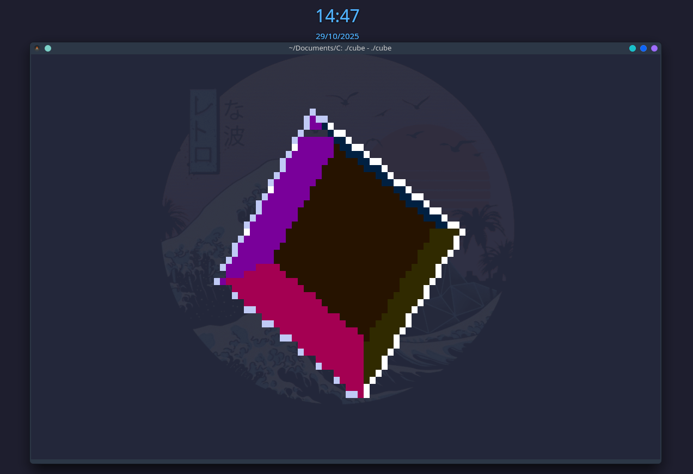

# Terminal 3D Cube Renderer



## Overview

High-fidelity 3D cube rendered directly in the Linux terminal using half-block glyphs and 24-bit ANSI color. The renderer features full perspective projection, per-pixel depth buffering, dynamic Phong lighting, back-face culling, and silhouette outlining for razor-sharp edges. Runtime zoom controls let you adjust the cube scale without restarting the program.

## Features

- Perspective projection with robust frustum culling
- Barycentric triangle rasterization over a half-pixel grid
- Independent top/bottom depth buffers for accurate shading
- Dynamic ambient, diffuse, and specular lighting
- Double-buffered terminal output with truecolor ANSI escapes
- Interactive zoom (`+`/`-`) and graceful exit (`q`/`Esc`)

## Build

```bash
gcc -std=c11 -O3 -march=native -pipe -Wall -Wextra -Wshadow -Wconversion -pedantic cubev1.c -lm -o cube
```

Dependencies: GNU libc, POSIX termios/ioctl, and a terminal supporting 24-bit color and the alternate screen buffer.

## Run

```bash
./cube
```

Controls:
- `+` / `=`: Zoom in
- `-` / `_`: Zoom out
- `q` / `Esc`: Quit

For the version that uses `main.c`, adjust the compile command accordingly. Run the program inside a truecolor terminal emulator for best visual fidelity.